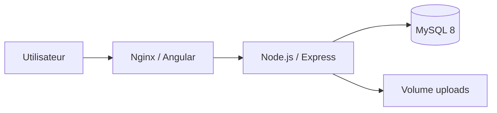

# DevOps — Career Platform

Ce guide décrit comment lancer, tester et déployer la plateforme avec Docker et CI/CD.

## Architecture



| Service   | Port par défaut | Rôle                          |
|-----------|-----------------|-------------------------------|
| frontend  | 80              | Application Angular (Nginx)   |
| backend   | 3000            | API REST + Prisma             |
| db        | 3306            | Base MySQL                    |

## Prérequis

- [Docker Desktop](https://www.docker.com/products/docker-desktop/) (Windows / macOS / Linux)
- Node.js 20+ (développement local sans Docker)

## Démarrage rapide (production locale)

```powershell
cd career-platform
copy .env.example .env
# Éditez .env si besoin (JWT_SECRET, mots de passe MySQL)

docker compose up -d --build
```

- Frontend : http://localhost  
- Backend : http://localhost:3000  
- Health backend : http://localhost:3000/health  

Pour charger les données de démo :

```env
RUN_SEED=true
```

Puis `docker compose up -d --build`.

## Développement local (sans Docker pour l'app)

1. Lancer uniquement MySQL :

```powershell
docker compose -f docker-compose.dev.yml up -d
```

2. Backend :

```powershell
cd backend
copy .env.example .env
npm install
npx prisma migrate deploy
npm run dev
```

3. Frontend :

```powershell
cd frontend
npm install
npm start
```

L'application est sur http://localhost:4200 et l'API sur http://localhost:3000.

## Variables d'environnement

| Variable        | Description                                      |
|-----------------|--------------------------------------------------|
| `DATABASE_URL`  | URL Prisma MySQL                                 |
| `JWT_SECRET`    | Secret pour les tokens JWT                       |
| `CORS_ORIGIN`   | Origines autorisées (séparées par des virgules)  |
| `API_URL`       | URL API injectée au build du frontend Docker     |
| `FRONTEND_URL`  | URL publique du frontend (QR codes, etc.)        |
| `RUN_SEED`      | `true` pour exécuter `prisma db seed` au démarrage |

## CI/CD (GitHub Actions)

Le workflow `.github/workflows/ci.yml` exécute à chaque push/PR :

1. **Backend** — migrations Prisma + smoke test `/health`
2. **Frontend** — build Angular production
3. **Docker** — `docker compose build`

Pour activer le pipeline, poussez le dossier `career-platform` vers un dépôt GitHub.

## Commandes utiles

```powershell
# Logs
docker compose logs -f backend

# Arrêter
docker compose down

# Tout supprimer (y compris les volumes)
docker compose down -v

# Reconstruire une image
docker compose build backend --no-cache
```

## Déploiement cloud (pistes)

- **Azure / AWS / GCP** : pousser les images Docker vers un registry (ACR, ECR, GCR) et déployer sur App Service, ECS ou Cloud Run.
- **Kubernetes** : utiliser les Dockerfiles existants + secrets pour `DATABASE_URL` et `JWT_SECRET`.
- **GitHub Container Registry** : ajouter un job `docker push` dans un workflow CD (non inclus par défaut).

## Structure DevOps ajoutée

```
career-platform/
├── .github/workflows/ci.yml
├── docker-compose.yml
├── docker-compose.dev.yml
├── .env.example
├── backend/Dockerfile
├── backend/docker-entrypoint.sh
├── frontend/Dockerfile
├── frontend/nginx.conf
└── DEVOPS.md
```
