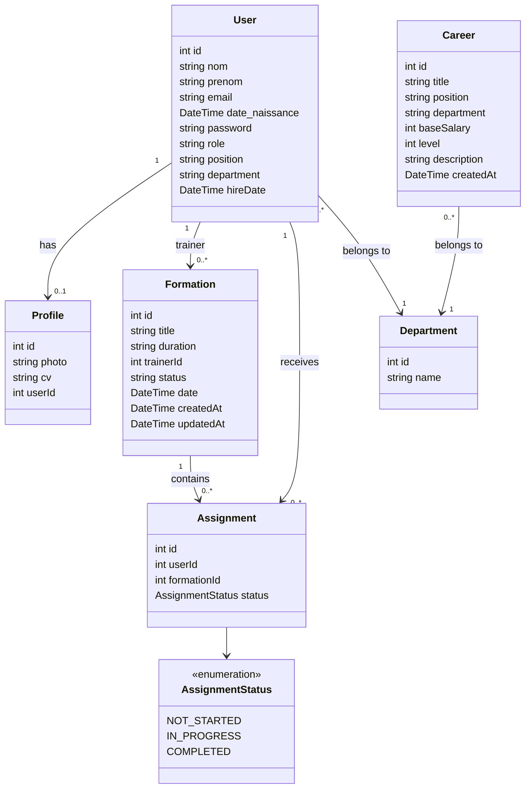
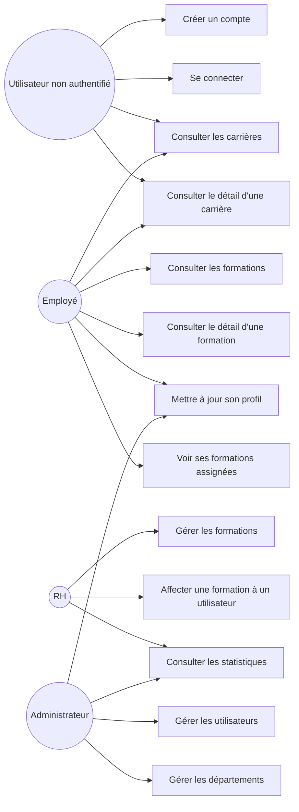
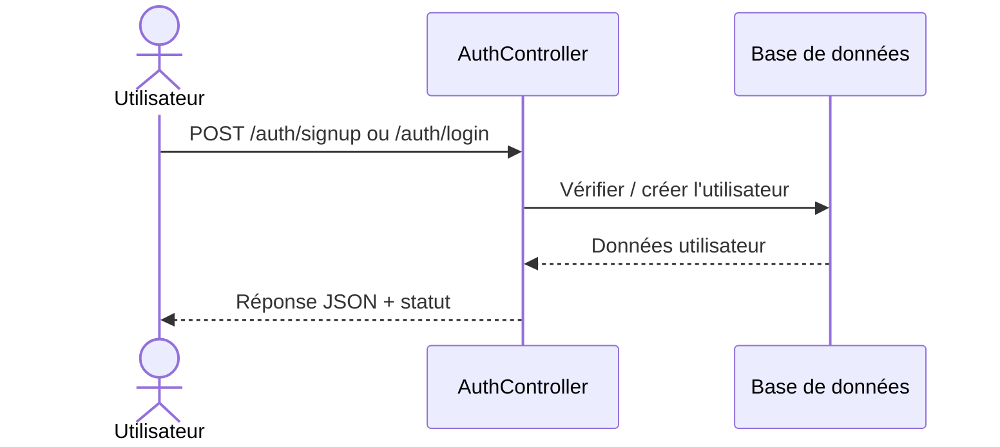
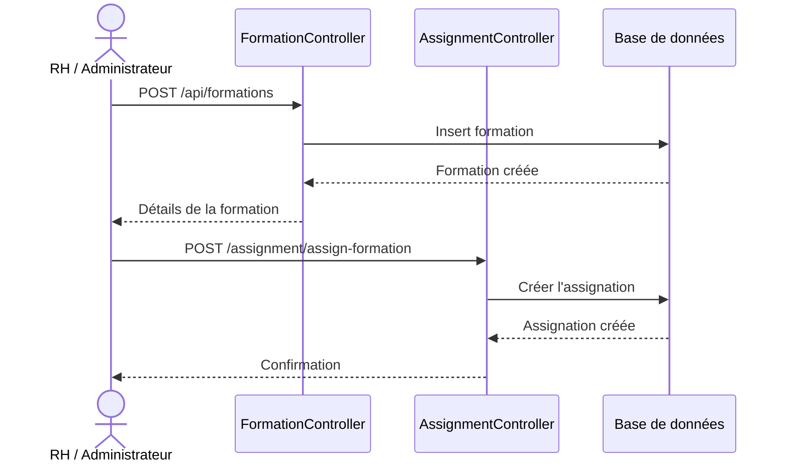
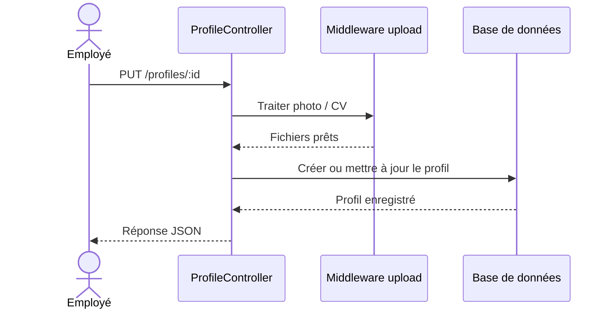

# Diagrammes pour le rapport

Ce document regroupe les diagrammes principaux du projet sous une forme adaptée à un rapport académique. Les formulations sont volontairement simples et centrées sur les fonctionnalités métier.

## 1) Diagramme de classes

Ce diagramme présente les entités principales du système et leurs relations.

## 2) Diagramme de cas d'utilisation

Ce diagramme montre les interactions entre les différents acteurs et les fonctionnalités offertes par la plateforme.

## 3) Diagrammes de séquence

Les séquences ci-dessous illustrent les échanges entre l'utilisateur, les contrôleurs applicatifs et la base de données.

### 3.1 Inscription / connexion

Cette séquence résume l'authentification de l'utilisateur.

### 3.2 Création et affectation d'une formation

Cette séquence montre le cycle de vie principal d'une formation : sa création puis son affectation à un utilisateur.

### 3.3 Mise à jour du profil

Cette séquence décrit la mise à jour du profil avec upload de fichiers.

## 4) Remarque

Le modèle Prisma montre une relation explicite entre `User`, `Formation`, `Assignment` et `Profile`. Les modèles `Career` et `Department` sont aussi représentés dans le diagramme avec des liens métier vers le département pour refléter leur appartenance fonctionnelle.

Si tu veux, je peux aussi te préparer une version encore plus propre pour le rapport, avec une mise en page plus courte et un style plus académique, ou te donner une version PlantUML prête à exporter en image.